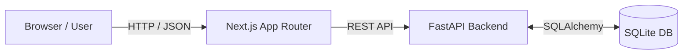
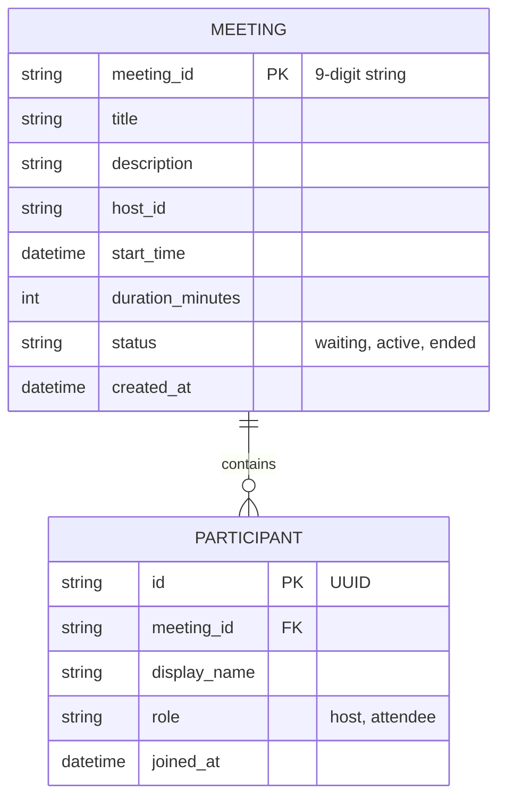

# Zoom Workplace Clone

A pixel-perfect, fully functional clone of the Zoom web client UI powered by a Next.js App Router frontend and a FastAPI + SQLite backend. This application mimics the core meeting creation, scheduling, and join flows of Zoom without implementing actual WebRTC audio/video.

**Live app:** `<url>`  
**API:** `<url>`

## Features
- **Dashboard:** "New Meeting", "Join", "Schedule", Upcoming, and Recent tabs.
- **Meeting Room:** A fully responsive mock meeting environment with toggleable Mic/Video buttons, participant grid layout logic, Chat panel, and Participants panel.
- **Join Flows:** Validates Meeting IDs, prompts for a display name, and securely joins the meeting as an attendee or bypasses as host.
- **API Backend:** A robust FastAPI REST backend running on an ephemeral SQLite database that automatically seeds default user data and test meetings.

## Tech Stack
- **Frontend:** Next.js 14 (App Router), React, TypeScript, Tailwind CSS, Lucide Icons.
- **Backend:** Python 3.11+, FastAPI, Uvicorn, SQLAlchemy 2.0, Pydantic v2, Pytest.
- **Database:** SQLite (Ephemeral)

## Architecture



## Folder Structure
```text
/
├── .env.example               # Frontend environment template
├── app/                       # Next.js App Router pages
├── backend/
│   ├── .env.example           # Backend environment template
│   ├── app/
│   │   ├── main.py            # FastAPI application entrypoint
│   │   ├── models.py          # SQLAlchemy models
│   │   ├── routers/           # API Endpoints
│   │   ├── services/          # Business logic
│   │   └── database.py        # SQLite configuration
│   ├── tests/                 # Pytest test suite
│   ├── requirements.txt       # Backend dependencies
│   └── render.yaml            # Render deployment config
├── components/                # Reusable React components (UI, meeting-room, forms)
├── docs/
│   └── CODE_WALKTHROUGH.md    # System explanation guide
├── lib/                       # API clients and utilities
└── types/                     # Shared TypeScript interfaces
```

## Setup for Local Development

### 1. Backend Setup
1. Open a terminal and navigate to the backend directory:
   ```bash
   cd backend
   ```
2. Create and activate a Python virtual environment:
   ```bash
   python -m venv venv
   source venv/bin/activate  # On Windows: venv\Scripts\activate
   ```
3. Install dependencies:
   ```bash
   pip install -r requirements.txt
   ```
4. Copy the environment variables:
   ```bash
   cp .env.example .env
   ```
5. Start the FastAPI server:
   ```bash
   uvicorn app.main:app --reload --port 8000
   ```

### 2. Frontend Setup
1. Open a new terminal in the project root.
2. Install Node dependencies:
   ```bash
   npm install
   ```
3. Copy the environment variables:
   ```bash
   cp .env.example .env.local
   ```
4. Start the Next.js development server:
   ```bash
   npm run dev
   ```

## Environment Variables

### Frontend (`.env.local`)
| Variable | Description | Example |
| :--- | :--- | :--- |
| `NEXT_PUBLIC_API_BASE_URL` | The URL of the FastAPI backend | `http://localhost:8000` |

### Backend (`backend/.env`)
| Variable | Description | Example |
| :--- | :--- | :--- |
| `DATABASE_URL` | SQLite connection string | `sqlite:///./zoomclone.db` |
| `FRONTEND_BASE_URL` | The domain of the deployed frontend | `http://localhost:3000` |
| `CORS_ORIGINS` | Comma-separated allowed origins | `http://localhost:3000` |

## Seeded Data for Testing
Upon starting the backend with an empty database, it automatically seeds these test meetings:
- **Instant Meeting:** `123 456 789`
- **Scheduled Meeting:** `987 654 321`

## Database Schema (ER Diagram)



## API Endpoints

| Method | Endpoint | Description |
| :--- | :--- | :--- |
| `GET` | `/health` | Server health check and wake-up. |
| `GET` | `/api/meetings` | Returns all seeded/user meetings. |
| `POST` | `/api/meetings` | Creates an instant or scheduled meeting. |
| `GET` | `/api/meetings/{id}` | Gets a specific meeting by ID. |
| `POST` | `/api/meetings/{id}/join` | Validates a meeting and adds a participant. |
| `POST` | `/api/meetings/{id}/leave`| Removes a participant from a meeting. |
| `GET` | `/api/meetings/{id}/participants` | Lists all participants in a room. |

## Deployment Steps

1. **Deploy the Backend to Render:**
   - Connect your GitHub repository to Render.
   - Choose the `Blueprint` configuration using the existing `render.yaml`.
   - Wait for the API to deploy and note the resulting `<BACKEND_URL>`.

2. **Deploy the Frontend to Vercel:**
   - Connect your GitHub repository to Vercel.
   - Set the `NEXT_PUBLIC_API_BASE_URL` environment variable to your `<BACKEND_URL>` (e.g., `https://zoomclone-backend.onrender.com`).
   - Deploy and note the resulting `<FRONTEND_URL>`.

3. **Configure Backend Environment Variables:**
   - In the Render dashboard, go to the Environment section for your backend.
   - Set `FRONTEND_BASE_URL` to `<FRONTEND_URL>`.
   - Set `CORS_ORIGINS` to `<FRONTEND_URL>`.
   - Restart the backend server.

## Assumptions & Known Limitations
- **No WebRTC:** This is a UI and state management clone. There is no real video or audio transmission.
- **No Authentication:** There is no user login. The "host" is hardcoded to "Priya Sharma" in both the frontend and backend seed data.
- **Ephemeral Database:** The SQLite database is stored locally on the server container. On free-tier services like Render, the disk is wiped on spin-down or redeploy. The app accounts for this by automatically re-seeding the DB on startup.
- **Cold Starts:** Free-tier backends spin down after 15 minutes of inactivity. The Next.js frontend sends a background `/health` ping on load to wake the server, and failing an immediate response, gracefully retries while showing a "Waking up the server" toast.

---
**Note:** AI tools were used to assist in the rapid development of this project. The final source code has been thoroughly reviewed, modified, and is fully understood by the author.
